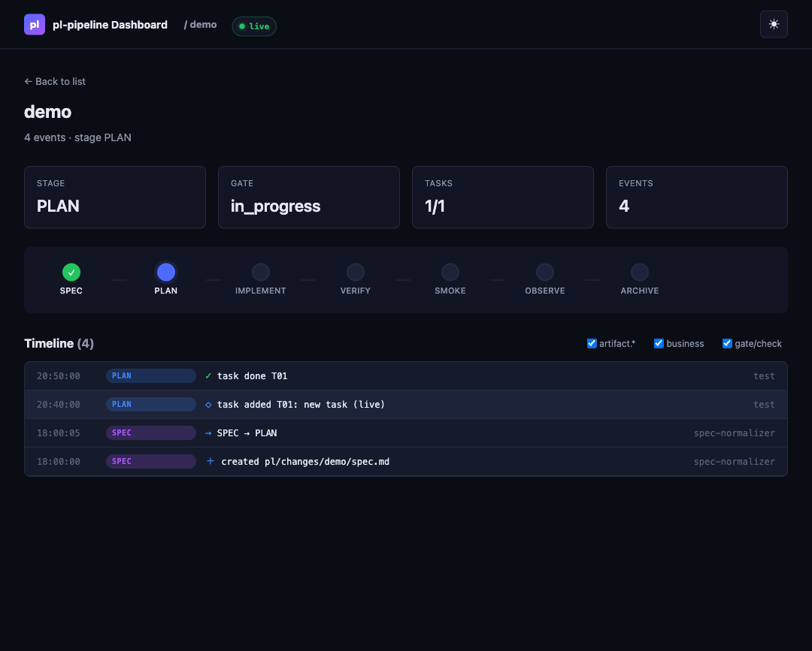

# Dashboard 使用指南

> **适用版本**：`pl-v1.3.2-alpha.2` 起（live reload 稳定版）
> **上一份文档**：[dashboard/README.md](../dashboard/README.md) 偏开发者；本文偏**用户使用**。

pl-pipeline Dashboard 是一个零构建、零第三方依赖、基于 SSE 推送的可视化面板，用来看项目里每个 change 的 pipeline 进展。

---

## 30 秒上手

```bash
# 在你的项目根目录（有 pipeline-output/trace/*.events.jsonl 即可）
export PL_HOME=/path/to/pl-pipeline-standalone
bash $PL_HOME/scripts/pl-dashboard.sh --open
```

默认会：
1. 扫描 `$PWD/pipeline-output/trace/*.events.jsonl` 生成索引
2. 在 **http://127.0.0.1:8889** 启动带 SSE 的 HTTP server
3. 用系统默认浏览器打开首页

按 `Ctrl+C` 停止。

---

## 截图示例

Change 详情页（实时更新）：



左上 "● live" 徽章说明 SSE 已连通，新写入 `events.jsonl` 的事件会在 1–2 秒内出现在 Timeline 顶部并带 1.2s 闪烁高亮。

---

## 三种启动姿势

### 姿势 1 — 默认（最常用）
```bash
bash $PL_HOME/scripts/pl-dashboard.sh
```
- 扫描当前目录下的 `pipeline-output/trace/`
- Live reload 开启（SSE）
- 端口 8889

### 姿势 2 — 指定项目 / 端口 / 自动开浏览器
```bash
bash $PL_HOME/scripts/pl-dashboard.sh \
  --project /path/to/another-project \
  --port 9001 \
  --open
```

### 姿势 3 — 降级为静态模式
```bash
bash $PL_HOME/scripts/pl-dashboard.sh --static-only
```
使用 `python3 -m http.server`，**没有 live reload**，刷新才能看到新事件。
适用场景：
- 在高安全环境不允许自定义 HTTP 进程
- 只想看历史快照，不关心实时

### 姿势 4 — 仅生成索引不起 server
```bash
bash $PL_HOME/scripts/pl-dashboard.sh --no-server
```
生成 `$PL_HOME/dashboard/_data.json` 后退出。自己用 CI 去托管静态文件时有用。

---

## 视图详解

### 首页 — Changes List (`/`)

```
┌──────────────────────────────────────┐
│  [feat-auth]            [in progress]│
│  IMPLEMENT                           │
│  ✓——✓——●——○——○——○——○                │  ← mini stage pipeline
│  ◇ 2/3   ● 8             3m ago      │  ← tasks / events / last update
└──────────────────────────────────────┘
```

列表按 `_data.json` 顺序排列。每个卡片四项指标：

| 图标 | 含义 |
|------|------|
| `◇ X/Y` | 已完成任务数 / 规划任务数（基于 `plan.task.added` 和 `task.done`） |
| `● N` | 事件总数 |
| `⚠ N` | violation / failed check 计数（仅在 > 0 时显示，红色） |
| `Xm ago` | 最近一条事件的相对时间 |

Gate 徽章四态：
- `in progress`（蓝）— 当前阶段还没跑门禁
- `passed`（绿）— 最近一次 gate.eval 过了
- `blocked`（红）— 最近一次 gate.eval 被 block
- `skipped`（黄）— SMOKE 阶段被 opt-out

**Live reload 行为**：
- 新 change 出现 → 卡片自动 append（有淡入动画）
- 现有 change 有事件追加 → 对应卡片整体 re-render（任务数 / 事件数 / 时间戳更新）
- trace 文件被删除 → 对应卡片自动消失

### 详情页 — Change Timeline (`/change.html?id=<change_id>`)

从首页点任何卡片进入，或直接访问带 `?id=` 的 URL。

**四个 info card**：Stage / Gate / Tasks / Events（都是基于全量事件聚合）

**横向 Stage Pipeline**：
```
SPEC ──▶ PLAN ──▶ IMPLEMENT ──▶ VERIFY ──▶ SMOKE ──▶ OBSERVE ──▶ ARCHIVE
 ✓       ✓         ●             ○         ○         ○            ○
```
- ✓ 已完成（绿）
- ● 当前正在进行（蓝）
- ✕ 当前阶段 blocked（红）
- ○ 尚未进入（灰）

**Timeline**：事件倒序（最新在上），每行含：
- 时间戳（`HH:MM:SS` 本地时区）
- Phase 徽章（带颜色：SPEC 紫 / PLAN 蓝 / VERIFY 黄 / OBSERVE 绿 / ...）
- 事件标题（图标 + 文字）
- actor（仅显示 id 主体，版本省略）

点任意事件行 → 展开 payload。

**三维过滤**（右上角）：
- `artifact.*` — 文件创建 / 修改 / 删除类
- `business` — plan / task / state / asset 类业务事件
- `gate/check` — gate.eval / check.run / smoke.* 门禁类

**自动定位**：首次进入自动滚到**第一个 critical 事件**（blocked gate / failed check / violation），方便快速排错。

**Live reload 行为**：
- 新事件写入 → 1–2 秒内追加到 Timeline 顶部，带 1.2s accent-color 闪烁
- info card / stage pipeline **同步重算**（不只是追加事件行）
- trace 文件被截断 / rotate → 页面自动 reset 并重新订阅

---

## Live 徽章 — 连接状态

头部导航右侧有一个小徽章，四态：

| 徽章 | 含义 | 对应动作 |
|------|------|---------|
| 🟢 `● live` | SSE 已连接，事件实时推送 | 正常 |
| 🟡 `◐ connecting` | 正在建立连接 / 自动重连中 | 等 1–2 秒 |
| 🔴 `✕ reconnect` | 连接断开，正在指数退避重连（最长 15s） | 检查 server 是否还在跑 |
| ⚪ `○ static` | server 不支持 SSE，当前是一次性加载 | 需要 live 请用默认 server 启动 |

> **小知识**：`● live` 的绿点有 1.8s 呼吸光晕，`◐ connecting` 是 0.9s 快速脉动，用眼角余光就能区分是否工作正常。

---

## Contract 角标 — pact 健康度（v1.7.2+）

跟 v1.7 CDC 双向闭环配套。Dashboard 现在会读 `pl/contracts/<change>.consumed.yaml` 并对照
当前 `adapter.yaml` 的 `provides.*`，把每个 change 的 pact 状态以一个角标显示在卡片上：

| 角标 | 颜色 | 含义 |
|------|------|------|
| `pact ✓` | 绿 | satisfied — adapter 仍提供 consumer 用过的所有资产 |
| `pact ! N` | 黄 | warn — N 个 capability 已 `deprecated_in <= current`，还能用但要计划迁移 |
| `pact ✗ N` | 红 | broken — N 处 violation：skill/rule/build_command 被删，或 capability `removed_in/null` |
| (无) |  — | 该 change 还没进 ARCHIVE → `pl-contract-aggregate.sh` 还没产出 pact，或 contracts dir 不存在 |

鼠标悬停（title 提示）会列出前 3 条 violation/warning 的 `kind/id`。

页面顶部会同时显示一行汇总：

```
CDC contracts  ✓ 3 satisfied  ! 1 warn  ✗ 2 broken   across 6 changes
```

### 数据来自哪里

```
GET /_data/contracts.json   ← 新端点，3s TTL 缓存
```

服务端实现：dashboard-server.py 调用 `bash $PL_HOME/scripts/pl-contract-verify.sh --json`，
削减成 dashboard 需要的形态（status / 计数 / 前 3 条示例），不会把全部 violation 详情灌给前端。

刷新时机：
- 首次加载 / 路由切回首页 → fetch 一次
- 收到 `_events/index updated` 推送 → 再 fetch 一次（典型场景：某个 change 跑完 ARCHIVE，
  auto-aggregate hook 重写 pact，几秒内角标自动跳转）

### 当端点不可用时

`/_data/contracts.json` 返回 `{ available: false, reason: "..." }` 的合法 JSON，
前端识别后直接不渲染角标和顶部汇总（卡片上其它信息不受影响）。常见 reason：

- `dashboard server 没拿到 --pl-home / --pl-project` — 你用了纯 `python3 -m http.server` 启动；走 `pl-dashboard.sh` 即可
- `no pacts yet (run pl-runner.sh through ARCHIVE)` — 项目还没产出过 pact
- `pl-contract-verify.sh not found` — `--pl-home` 指错了

完整查询语义见 [adapter-authoring.md §12.4 / §12.5](./guides/adapter-authoring.md)。

---

## Contract 下钻 — 看 violation 详情（v1.7.3+）

v1.7.2 的角标只回答"红 or 绿"。v1.7.3 让你**点角标**直接跳到 change 详情页的 Contract 区块，
给出每条 violation 的 `kind / id / severity / reason`，以及对应源文件的绝对路径——能直接复制
丢进 IDE 跳转。

### 入口

| 从哪 | 怎么进入 |
|------|---------|
| 首页 | 直接点卡片上的 `pact ✗ N` / `pact ! N` / `pact ✓` 角标（不会触发整张卡片的跳转） |
| change 详情页 | URL 加 `#contract` anchor，如 `change.html?id=add-todo-list#contract` |
| 任何外部链接 | 同上 anchor，会自动滚到 Contract 卡片 |

### 看到什么

```
┌─ Contract  ✗ broken   vs nextjs-web@0.1.0     [📋 copy adapter.yaml path]
│  2 broken · 0 warn · 12 satisfied
│
│  ✗ Broken (2)
│  ┌────────┬─────────────────────────────────────────────────┬──────────────┐
│  │ kind   │ id / reason                                     │              │
│  ├────────┼─────────────────────────────────────────────────┼──────────────┤
│  │ skill  │ react-server-components                         │ 📋 copy path │
│  │        │ consumer used skill/react-server-components     │              │
│  │        │ (uses=1) but adapter no longer provides it      │              │
│  ├────────┼─────────────────────────────────────────────────┼──────────────┤
│  │ rule   │ react-hooks                                     │ 📋 copy path │
│  │        │ consumer used rule/react-hooks (uses=4) but ... │              │
│  └────────┴─────────────────────────────────────────────────┴──────────────┘
│
│  ▶ ✓ 12 satisfied (展开查看)
└─
```

### 数据来自哪里

```
GET /_data/contract-detail.json?change=<change_id>   ← 新端点，3s TTL per-change 缓存
```

服务端用 `pl-contract-verify.sh --change <id> --json` 跑单个 change 的完整 verify report，
**不削减** violation/warning 列表，并为每条记录补上 `source_path` 绝对路径：

| kind | source_path 解析规则 |
|------|----------------------|
| `skill` | `adapters/<dir>/skills/<id>.{md,yaml,yml}` |
| `rule` | `adapters/<dir>/rules/<id>.{md,yaml,yml}` |
| `agent` | `adapters/<dir>/agents/<id>.{md,yaml,yml}` |
| `template` | `adapters/<dir>/templates/<id>.{md,yaml,yml}` |
| `build_command` / `capability` / `adapter` | `adapters/<dir>/adapter.yaml` |

`<dir>` 通过扫 `$PL_HOME/adapters/*/adapter.yaml` 取 `metadata.id`，30s 缓存。
解析失败 → `source_path: ""`，前端不渲染复制按钮（其它信息照常显示）。

### 当端点不可用时

跟 `/_data/contracts.json` 同样的 graceful degradation —— 返回 `{ available: false, reason: ... }`，
前端识别后整个 Contract 区块不渲染（隐藏 `<section id="contract-section">`），其它部分不受影响。
常见 reason 见上节。

---

## 常见问题

### Q1. 页面打开但卡片/事件是空的

**检查顺序**：

```bash
# 1. trace 目录是否有数据
ls $PL_PROJECT/pipeline-output/trace/*.events.jsonl

# 2. 每个 jsonl 是否有合法内容
head -1 pipeline-output/trace/*.events.jsonl | jq -c .

# 3. server 是否正确访问到 trace
curl http://127.0.0.1:8889/_data.json | jq .
```

如果 `_data.json` 显示 `changes` 是空数组，说明 `pl-dashboard.sh` 启动时 trace 目录还不存在——重启即可。

### Q2. 只看到 "○ static" 不是 "● live"

说明 server 是 `python3 -m http.server` 模式（`--static-only`，或 server 启动失败退回）。

```bash
# 确认当前跑的进程类型
ps aux | grep -E "dashboard-server|http.server" | grep -v grep
```

如果看到 `dashboard-server.py`，检查浏览器 Network 面板里 `/_events/ping` 的响应 `Content-Type` —— 必须是 `text/event-stream`，否则前端 probe 判定不支持。

### Q3. 多开 tab 时有的 tab 没数据

**在 v1.3.2-alpha 中是个 bug**，已在 **v1.3.2-alpha.2** 修复：snapshot 现在是 per-subscriber 生成，每个 tab 独立收到全量。

升级：`git pull` + 重启 `pl-dashboard.sh`。

### Q4. 端口被占用

```
OSError: [Errno 48] Address already in use
```

```bash
# 找出占用进程
lsof -i :8889

# 如果是旧的 dashboard-server.py，强杀
pkill -9 -f dashboard-server.py

# 或者换个端口
bash $PL_HOME/scripts/pl-dashboard.sh --port 9001
```

### Q5. 我想在另一台机器访问 Dashboard

默认只 bind `127.0.0.1` 为了安全。要局域网访问：

```bash
# 需要改 dashboard-server.py 调用 --bind 0.0.0.0
# 或走 SSH 端口转发（更安全）：
ssh -L 8889:127.0.0.1:8889 user@remote-host
# 然后本地浏览器访问 http://localhost:8889
```

⚠️ 直接 bind `0.0.0.0` 会把整个 trace 目录和推送事件暴露到网络，**不建议在不可信网络使用**。

---

## 调试技巧

### 观察 SSE 流
```bash
# 订阅某 change 的实时事件
curl -N http://127.0.0.1:8889/_events/stream?change=feat-auth

# 订阅目录变化
curl -N http://127.0.0.1:8889/_events/index
```

### 静默日志 → 看详细日志
```bash
PL_DASHBOARD_VERBOSE=1 bash $PL_HOME/scripts/pl-dashboard.sh
```

### 触发一次 live append 测试
```bash
# 在 Dashboard 已打开的情况下，往 jsonl 追加一行
echo '{"ts":"2026-04-23T14:00:00Z","trace_id":"t99","change_id":"feat-auth","phase":"IMPLEMENT","actor":"agent:coder@1.0","event":"task.done","data":{"task_id":"T03"}}' \
  >> pipeline-output/trace/feat-auth.events.jsonl

# 观察浏览器是否 1–2 秒内出现新行且 Tasks 计数变化
```

---

## 技术对照表

| 能力 | 实现 | 位置 |
|------|------|------|
| 静态文件托管 | 自写 `ThreadingHTTPServer` | `scripts/_lib/dashboard-server.py` |
| SSE 推送 | 订阅时 per-subscriber 推 snapshot + watcher 追 append | 同上 |
| 文件 tail | Python stdlib 轮询 0.5s | 同上 |
| 客户端自动重连 | `EventSource` 原生 + 指数退避 1s→15s | `dashboard/assets/live.js` |
| 能力探测 | `HEAD /_events/ping` 校验 `Content-Type` | `dashboard/assets/live.js` |
| 降级 | probe 失败 → 一次性 fetch `_data.json` + jsonl | `dashboard/{index,change}.html` |
| Contract 角标（v1.7.2） | `GET /_data/contracts.json`，server 内调 `pl-contract-verify.sh --json`，3s TTL 缓存 | `scripts/_lib/dashboard-server.py` |
| Contract drill-down（v1.7.3） | `GET /_data/contract-detail.json?change=<id>`，单 change 完整 report + `source_path` 解析（adapter dir 扫描 30s 缓存） | `scripts/_lib/dashboard-server.py` + `dashboard/change.html` |

---

## 相关文档

- [`dashboard/README.md`](../dashboard/README.md) — 偏开发者的实现细节
- [`docs/retros/evidence-2026-04-v1.3.2/README.md`](./retros/evidence-2026-04-v1.3.2/README.md) — 里程碑封版记录
- [`CHANGELOG.md`](../CHANGELOG.md) — 完整变更列表（搜 v1.3.2）
